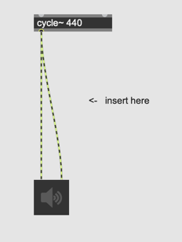

# K1. Sound processing in Frequency Domain

## Tutorials

- MSP Analysis Tutorial 3: Using the FFT
- MSP Analysis Tutorial 4: Signal Processing with pfft~

## Joseph Fourier

## Fourier Theorem

MSP Analysis Tutorial 3: Using the FFT

## Time domain vs Frequency domain

spectroscope~ is a frequency domain visualizer. 

## Applications

- Analyze
- Spectral EQ
- Spactral Gate
- Spectral Compressor
- Spectral Expander
- Spectral Limitter
- Spectral Shift
- Spectral Scale
- Spectral Freeze
- Spectral Crossfade
- Spectral Mixing
- Spectral Delay
- Spectral Decay
- Spectral Spatialization
- Spectral Order Randomization
- Cross-Synthesis
- Timbre Identification
- Phase Vocoder

## FFT Objects
### fft~ und ifft~

Ifft ... inverse FFT.

**FFT** converts time domain data to frequency domain data  
**IFFT** converts frequency domain data to time domain data

### Assignment 1

In max, the most basic objects for fft and ifft are [fft~] and [ifft~].  
Learn those two objects and insert [fft~] and [ifft~] between the [cycle~ 440] and [ezdac~] in the patch below, in order to convert the time domain data to frequency domain and convert back the frequency domain data to time domain data.  
The output sound should be exactly the same as the original patch after the insertion.

Hint: [fft~] and [ifft~] require arguments

### Assignment 2

use [capture~] and analyze the output coming from two outlets of [fft~] and observe the characteristics of the number printed on the Max console.

### Arguments for [fft~] and [ifft~] objects
- number of FFT samples ... The number of samples in the FFT it must be a power of two.
- spectral frame size ... the number of samples between successive FFTs. This must be at least the number of FFT samples and must be a power of two.

If [fft~ 512 2048] the frequency domain data is generated only once per every four FFT blocks.

### What does [fft~] do exactly?

This means 
- the higher the FFT size becomes, the higher resolution we get in the spectrum data
- the higher the FFT size becomes, the more samples are needed to be cached before the conversion, thus, the longer the delay time.

The FFT size controls the trade-off between these two parameters

#### bin
Each sample output from [fft~] represents the energy of frequency region.
First sample represents the energy from 0-86.1 Hz the next sample represents the energy from 86.1-172.2 Hz etc. We use a special term *bin* to express the samples in the frequency domain in order to distinguish it from the usual audio samples.

#### Aliasing
The data coming from fft~ covers the entire frequency range of the SR. Thus, the content of the spectral data is aliased. If fft size is 512. the content of bin 0-255 are mirrored in bin 256- 511.

### Why does fft~ offer two outlets

### Complex plane

The output from [fft~] can be plotted on a complex plane.

x = real  
y = imaginary

In other words, we receive 512 points on the complex plane in one FFT block if the FFT size is 512.

### Summary

- [fft~] converts time domain data to frequency domain data
- [fft~] outputs two streams of numbers because frequency domain data is expressed as pairs of numbers; real and imaginary number

### How can we extract the data of spectrum from those two number (real - imaginary)?

### Assignment 3

The **distance** from the center of the complex plane and the points given by fft~ represents the energy of each frequency region. The distance is sometimes called **Magnitude**.  

In the patch below, calculate the distance of each bin and visualize them in a waveform~ by storing them in a [buffer~ spectrum]

Hint 1: Pythagorean theorem  
Hint 2: the third outlet of fft~ outputs bin index from 0 to 511.  
Hint 3: [poke~] allows us to set a number in the specified buffer~ using signal  

### The Problem : Phase aligned vs Phase unaligned Signal

### Assignment 4
When SR = 44100, How large is one frequency region that one FFT bin covers when FFT size is 512?  
When SR = 48000, How large is one frequency region that one FFT bin covers when FFT size is 1024?  
When SR = 96000, How large is one frequency region that one FFT bin covers when FFT size is 256?

### Assignment 5
Use the patch we created in assignment 3 and visualize the spectrum of sine waves whose frequency is multiple of the frequency region size. compare that with non-multiple of frequency region size.

### The cause of the problems observed in Assignment 5

The FFT algorithm assumes that the FFT block being analyzed comprise one cycle of periodic wave. If the frequency of the sine wave is aligned to the fundamental frequency of the FFT (512 samples in 44.1k = 86.1328 Hz) it works fine but in most cases, the 512 samples of the FFT will not be precisely one cycle of the wave. When that happens, the FFT still analyzes the 512 samples as if they were one cycle of a waveform, and reports the spectrum of that wave. Such an analysis will contain many spurious frequencies not actually present in the signal.

### The solution = Windowing

By applying windowing function (fadein-fadeout that is aligned to the size of FFT) we can make any kind of signal an aligned signal. For that we usually use the hanning window.

### Assignment 6

Load the hanning.aiff to the patch of assignment 5, apply it to the signal before [fft~] and solve the problem.

### Further References
[but what is FFT](https://www.youtube.com/watch?v=spUNpyF58BY)