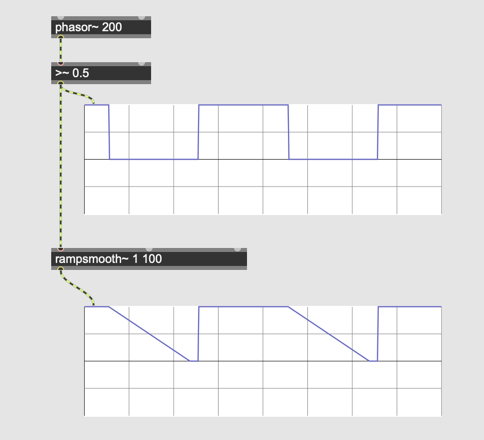
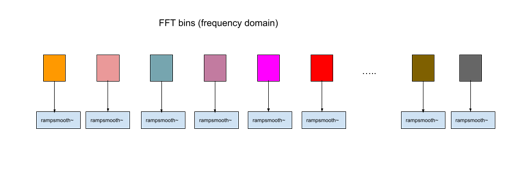
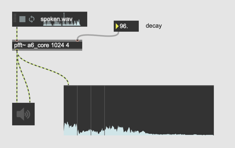

## K6. Spectral Delay und Decay

### Assignment 1: Spectral shifting
Each bin in pfft~ represents a spectral component of specific frequency range.
Theoretically, by displacing the spectral information of bin N to N+1, we can realize a kind of pitch shifting effect. Implement this "shifting bins" idea in a fft~.

Hint: delay~  

### Assignment 2: fbinshift~

[fbinshift~] object allows us to shift the spectrum, and it also enables the shift towards left (pitch down). Study the object [fbinshift~] and replace the delay~ used in the previous assignment.

### Assignment 3: Spectral scaling
Spectral shifting moves the entire spectrum left and right but theoretically we are also able to stretch or compress the spectral component. This is called spectral scaling. Implement the spectral scaling in a [pfft~] and make the scale factor controllable for the user

### Assignment 4: gizmo~

study [gizmo~] and replace [fbinshift~] in Assignment 2 patch with it. [gizmo~] object allows us to shift pitch using transposition ratio instead of the number of bins.

### Assignment 5: Spectral Delay

[delay~] and [fbinshift~] shift spectral component left and right in the same FFT frame but to apply delay that is a multiple of FFT size (in our case, the block size is 1024 so 2048, 3072, 4096 etc.), we can delay the bin information one FFT block, by keeping the original position of bin.

This delay can be applied individually to each FFT bin. This is called **spectral delay**.  
Implement spectral delay in [pfft~]

Hints:
- we can use buffer~ and waveform~ to control the delay time of each bin
- we have to force align the delay time to a multiple of FFT size
- [trunc~] is useful to truncate the decimal part of a floating point number

#### [vectral~]

[rampsmooth~] or [slide~] object it smooths the incoming signal.
In the example below, the incoming square wave is processed by [rampsmooth~] and the abrupt jump from 1 to 0 are smoothened by the [rampsmooth~]

The difference between [vectral~] and [rampsmooth~] is that [vectral~] applies the smoothing function against a vector, meaning each sample (or bins in the FFT context) of a vector is processed by the smoothing function individually.

### Assignment 6: Spectral Decay (advanced)

In [pfft~] we can extract magnitude and phase information using [cartopol~]. Apply decay function to the magnitude of each bin using [vectral~]'s rampsmooth mode, keeping the phase information intact.
